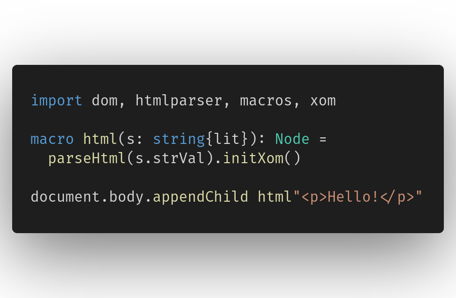

<a href="http://schneiderfelipe.xyz/xom/">
  
</a>

# xom

Transform XML trees into performant JavaScript DOM calls at *compile-time*
using Nim code.



The above will compile to the following JavaScript code:

```javascript
var p0 = document.createElement("p");
p0.appendChild(document.createTextNode("Hello!"));
document.body.appendChild(p0);
```

## Installation

xom supports Nim 1.4.0+ and can be installed using [Nimble](https://github.com/nim-lang/Nimble):

    $ nimble install xom

## Customizing code generation

xom can be customized to generate code that is optimized for a particular use
case.
Nodes can be modified in-place, new child nodes can be created, the code
generation can be suppressed all together for particular nodes, and variables
are only created for nodes that you specify.

All this customization is done through the use of the two simple callbacks of
the `Xom` context object:
- `onEnter*: XmlNode -> Command`
- `onEmitNamed*: (XmlNode, NimNode) -> void`

`onEnter` is called for every node that is found, and `onEmitNamed` is
called for every node for which a variable has been requested.
`onEnter` returns a `Command` object, which is an enum type that can be one of
the following:
- `Emit`: the node will be emitted but no variable will be created (default for
  all nodes).
- `EmitNamed`: the node will be emitted and a variable for it will be
  created. This also triggers a call to `onEmitNamed` on the node.
- `Skip`: the node will be skipped and no variable will be created.

Inside both callbacks, you can modify nodes in-place, and changes will be
reflected in the generated code *at compile-time*.

By default, no variables are created for nodes that are not requested *if not
necessary* (and necessary but not requested variables are always scoped by
default).
If you want to reference a node inside `onEmitNamed`, you *have* to return
`EmitNamed` from `onEnter` for that node.
In particular, text nodes are always merged together unless a variable is
being emitted for them.
Having a variable for a node is useful for dinamically modifying the node in
separately generated code (see `examples/` and `tests/` for some simple use
cases).
